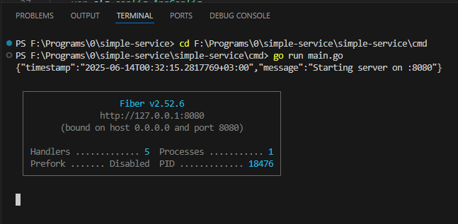
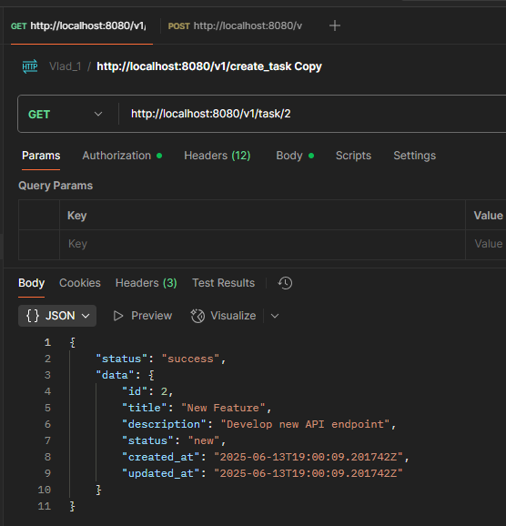
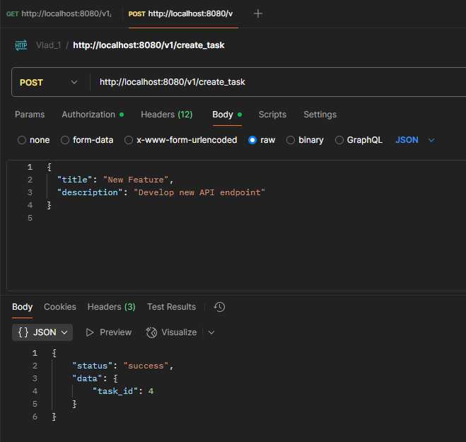
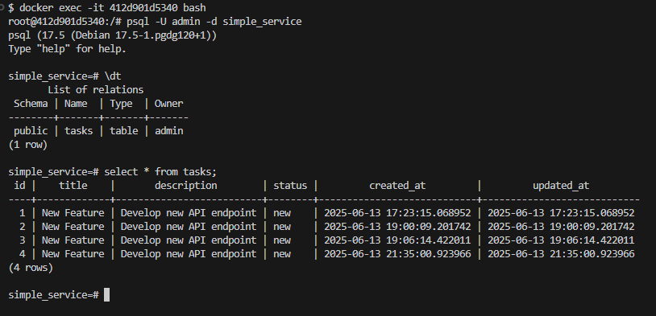

❌Работа в debug-режиме — используете дебаггер, точка остановки, просмотр переменных.

Раньше уже использовал дебаггер, но в данной программе он не запускается, пока не разобрался почему. 
Наверное, в goland такой проблемы нет.

------

✅Запущенный сервис — терминал с выводом go run main.go или подобным.

✅Запросы в Postman — пример удачного POST/GET/PUT запроса.

✅SQL-клиент (например, DataGrip) — подключение к базе данных.
✅Подтверждение наличия данных в таблице — SELECT-запрос к нужной таблице с результатом или любую табличку с любыми данными.
